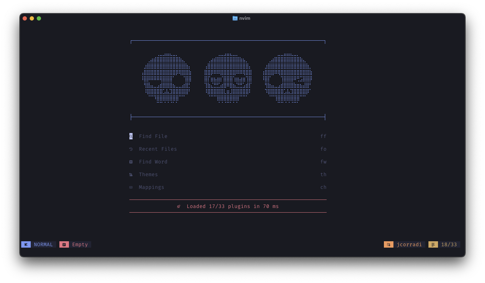

dotfiles
========

## Visuals

The whole setup is heavily inspired by [TokyoNight](https://github.com/tokyo-night) theme.

## Dependencies

- [asdf](https://asdf-vm.com/)
- [bat](https://github.com/sharkdp/bat)
- [eza](https://eza.rocks/)
- [fastfetch](https://github.com/fastfetch-cli/fastfetch)
- [fzf](https://junegunn.github.io/fzf/)
- [ghostty](https://ghostty.org/)
- [nvim](https://neovim.io/)
- [zoxide](https://github.com/ajeetdsouza/zoxide)
- [oh-my-zsh](https://ohmyz.sh/)

### MacOS

- [homebrew](https://brew.sh/)
- [yabai](https://github.com/koekeishiya/yabai)
- [skhd](https://github.com/koekeishiya/skhd)
- [borders](https://github.com/FelixKratz/JankyBorders)

### zsh plugins
- [fzf-tab](https://github.com/Aloxaf/fzf-tab)
- [zsh-256color](https://github.com/chrissicool/zsh-256color)
- [zsh-autopair](https://github.com/hlissner/zsh-autopair)
- [zsh-autosuggestions](https://github.com/zsh-users/zsh-autosuggestions)
- [zsh-completions](https://github.com/zsh-users/zsh-completions)
- [zsh-syntax-highlighting](https://github.com/zsh-users/zsh-syntax-highlighting)

## neovim

For general neovim setup, see [here](/.config/nvim)

